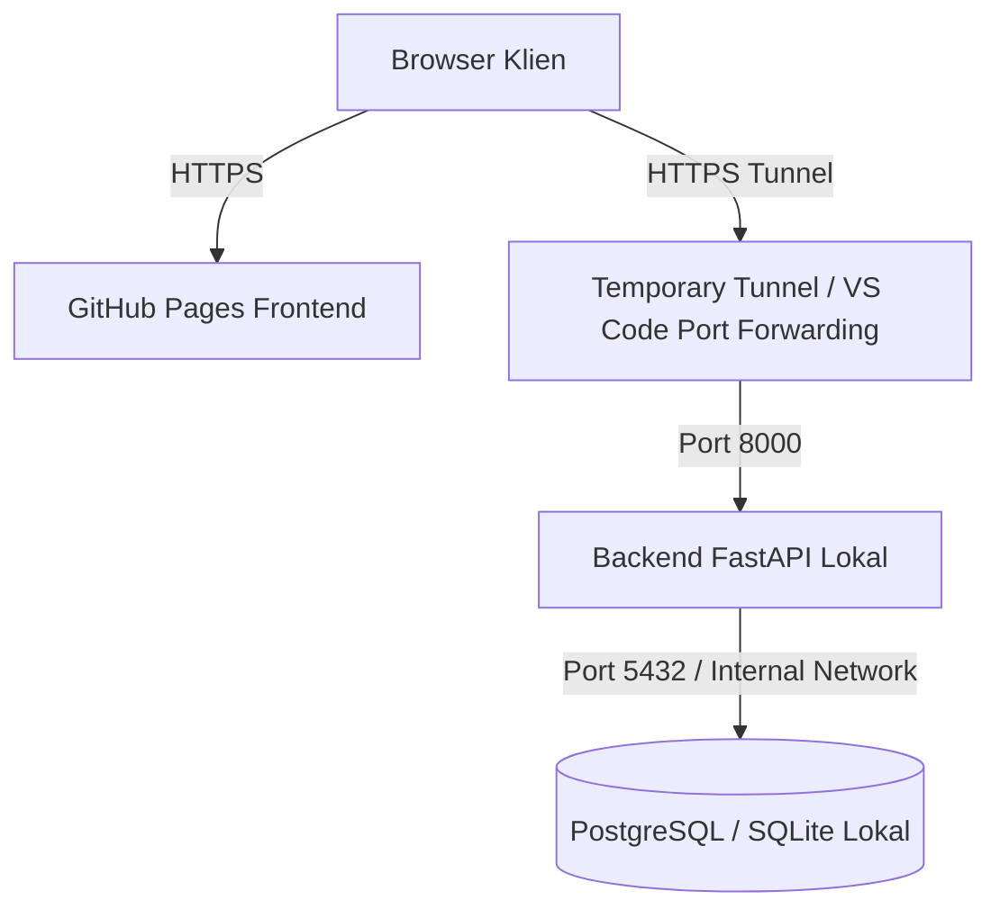

# GitHub Pages Demo Deployment Guide - OneSpirit Workflow

Dokumen ini menjelaskan konfigurasi, cara setup, arsitektur, dan troubleshooting untuk deployment demo OneSpirit Workflow berbasis GitHub Pages.

---

## 1. Tujuan Deployment
Deployment ini ditujukan untuk **demo klien dan validasi fungsional (client validation)** di lingkungan non-produksi. 
Tujuan utamanya adalah:
- Menyediakan frontend statis yang dapat diakses secara publik dan stabil oleh klien.
- Menghindari hosting infrastruktur cloud yang mahal untuk backend/database dengan memanfaatkan resource PC lokal selama sesi demo.
- Mempercepat feedback loop dengan klien.

---

## 2. Arsitektur Demo
Sistem demo berjalan dalam model hybrid:
- **Frontend**: Di-compile sebagai static SPA (Single Page Application) dan di-deploy ke **GitHub Pages** di URL: [https://osgueh-dotcom.github.io/onespirit/](https://osgueh-dotcom.github.io/onespirit/).
- **Backend**: Berjalan di **PC lokal** (FastAPI) dan diakses oleh frontend melalui temporary tunnel / VS Code Port Forwarding.
- **Database**: PostgreSQL (atau SQLite) berjalan di **PC lokal** di dalam network terisolasi (tidak boleh diekspos secara publik).



---

## 3. Cara Setup GitHub Repository Pages
Untuk mengaktifkan deployment otomatis via GitHub Actions:
1. Buka repositori GitHub Anda: `https://github.com/osgueh-dotcom/onespirit`.
2. Masuk ke tab **Settings** -> **Pages**.
3. Di bawah bagian **Build and deployment**, ubah **Source** menjadi **GitHub Actions**.
4. GitHub sekarang akan mendengarkan workflow `.github/workflows/deploy-pages.yml` yang terpicu setiap ada push ke branch `main`.

---

## 4. Cara Menambahkan Secret di GitHub Actions
Karena frontend perlu tahu URL backend tunnel saat build:
1. Buka repositori GitHub -> **Settings** -> **Secrets and variables** -> **Actions**.
2. Klik tombol **New repository secret**.
3. Masukkan detail berikut:
   - **Name**: `VITE_API_BASE_URL`
   - **Value**: URL backend tunnel Anda (misalnya: `https://xxxx-xxxx.ngrok-free.app` atau URL VS Code Port Forwarding).
4. Klik **Add secret**.

---

## 5. Cara Menjalankan Backend Lokal
Sebelum memulai demo, pastikan backend lokal Anda aktif:
1. Buka terminal di folder `backend/`.
2. Aktifkan virtual environment:
   ```bash
   .venv\Scripts\activate
   ```
3. Jalankan backend:
   ```bash
   uvicorn app.main:app --host 0.0.0.0 --port 8000
   ```
4. Verifikasi backend dapat diakses lokal di `http://localhost:8000/health`.

---

## 6. Cara Membuka VS Code Port Forwarding Backend
Jika menggunakan VS Code untuk Port Forwarding:
1. Buka tab **Ports** di panel bawah VS Code (di sebelah Terminal).
2. Klik **Forward a Port**.
3. Masukkan port backend: `8000`.
4. Ubah **Port Visibility** menjadi **Public** (Klik kanan pada port `8000` -> **Port Visibility** -> **Public**).
5. Salin URL yang dihasilkan di bawah kolom **Forwarded Address** (misalnya `https://xxxx-8000.ext.vsassets.io`). Gunakan URL ini sebagai base API.

---

## 7. Cara Update `VITE_API_BASE_URL` Sebelum Demo
Setiap kali URL tunnel berubah (ngrok/VS Code diperbarui):
1. Buka repositori GitHub -> **Settings** -> **Secrets and variables** -> **Actions**.
2. Cari secret `VITE_API_BASE_URL` lalu klik ikon edit (pensil).
3. Masukkan URL tunnel baru Anda.
4. Simpan perubahan.
5. Jalankan ulang workflow deployment untuk membangun kembali frontend dengan URL backend yang baru.

---

## 8. Cara Menjalankan Workflow Deploy
Secara default, workflow akan berjalan otomatis saat push ke branch `main`. Untuk memicu deployment manual:
1. Masuk ke repositori GitHub -> tab **Actions**.
2. Pilih workflow **Deploy OneSpirit Frontend to GitHub Pages** di panel kiri.
3. Klik dropdown **Run workflow** di sebelah kanan.
4. Pilih branch `main` lalu klik **Run workflow**.

---

## 9. Cara Membuka Frontend
Setelah workflow deploy selesai, buka alamat berikut di browser:
- [https://osgueh-dotcom.github.io/onespirit/](https://osgueh-dotcom.github.io/onespirit/)

Karena kita menggunakan hash routing, URL navigasi akan berformat:
- Login: `https://osgueh-dotcom.github.io/onespirit/#/login`
- Dashboard: `https://osgueh-dotcom.github.io/onespirit/#/`

---

## 10. Checklist Keamanan Demo
Pastikan Anda selalu mematuhi pedoman keamanan di [public-demo-safety-checklist.md](public-demo-safety-checklist.md):
- **Database Tidak Public**: Jangan pernah mengekspos port database `5432` ke tunnel luar.
- **Backend Tunnel Hanya Saat Demo**: Segera matikan tunnel/port forwarding setelah sesi demo berakhir.
- **Gunakan Data Dummy**: Jangan menampilkan data komersial atau kontrak asli PT One Spirit Asia.
- **Gunakan Akun Demo**: Gunakan `demo@onespirit.asia` untuk demonstrasi.

---

## 11. Troubleshooting & Masalah Umum

### A. Halaman Kosong (Blank Page)
* **Penyebab**: Base path Vite salah atau aset tidak dapat dimuat karena URL relatif.
* **Solusi**: Pastikan `base: '/onespirit/'` terkonfigurasi di [`frontend/vite.config.js`](../frontend/vite.config.js).

### B. Halaman 404 Saat Refresh Route
* **Penyebab**: Menggunakan HTML5 History mode (`createWebHistory()`) di static hosting GitHub Pages tanpa fallback `/404.html`.
* **Solusi**: Pastikan router menggunakan `createWebHashHistory()` di [`frontend/src/router/index.js`](../frontend/src/router/index.js).

### C. Error CORS (Cross-Origin Resource Sharing)
* **Penyebab**: Backend FastAPI memblokir request karena domain frontend `https://osgueh-dotcom.github.io` belum diizinkan di backend CORS.
* **Solusi**: Di backend, perbarui setting `BACKEND_CORS_ORIGINS` di file `.env` untuk menyertakan `https://osgueh-dotcom.github.io` (tanpa path `/onespirit/`).
  Contoh:
  ```env
  BACKEND_CORS_ORIGINS=http://localhost:5173,https://osgueh-dotcom.github.io
  ```

### D. API URL Masih Mengarah ke Localhost
* **Penyebab**: Project di-build tanpa menyuplai env `VITE_API_BASE_URL` di GitHub secrets, sehingga fallback ke `http://localhost:8000`.
* **Solusi**: Buat secret `VITE_API_BASE_URL` di repositori GitHub seperti dijelaskan di bagian 4 sebelum melakukan build.

### E. Build Gagal di GitHub Actions
* **Penyebab**: Lockfile tidak sinkron atau terdapat dependensi bermasalah saat `npm ci`.
* **Solusi**: Pastikan perintah `npm run build` berhasil dijalankan secara lokal di folder `frontend` sebelum melakukan push.
